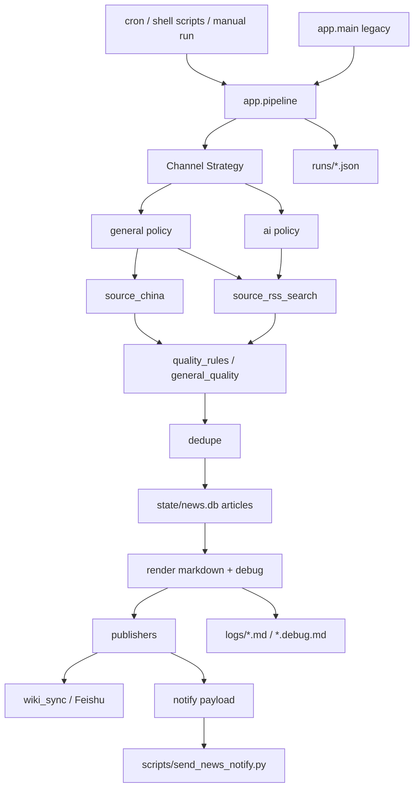
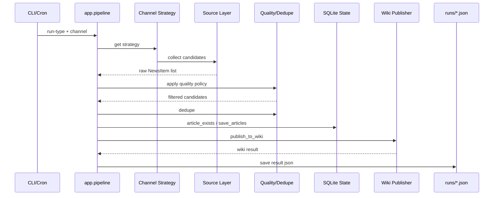

# Daily News Digest 技术架构文档

> 文档定位：基于当前代码、配置、脚本与现有文档生成的技术架构说明。  
> 约束：本文严格描述当前真实实现，不臆造未落地模块；对过渡态与未完全收束部分会明确标注。

---

## 1. 项目概述

### 1.1 业务定位
`Daily News Digest`（`news-digest`）是一个面向个人知识系统的自动化新闻生产与归档项目。它的目标不是单纯抓新闻，而是建立一条稳定的信息流水线：

- 按固定时间窗采集新闻
- 做去重、筛选与摘要整理
- 自动写入飞书知识库
- 自动推送结果链接
- 为后续知识沉淀与回查提供稳定入口

### 1.2 核心功能
当前真实已具备的核心功能包括：

- 双通道新闻生成：
  - `general`：综合热点
  - `ai`：AI / 大模型资讯
- 时间窗控制：`morning` / `evening`
- 候选新闻采集与标准化
- 事件级去重 + state 去重
- Markdown 渲染与 debug 日志输出
- 飞书知识库文档写入
- 结果通知与补发机制
- `runs/*.json` 运行结果记录与排障支持

### 1.3 技术目标
当前项目的技术目标主要是：

1. 稳定运行早晚两次日报流水线
2. 保持产出链路可观测、可补救、可追踪
3. 逐步把探索期脚本结构收束为可维护的分层架构
4. 在不牺牲生产能力的前提下，持续降低维护成本

---

## 2. 全量技术栈清单

### 2.1 语言 / 运行时
- Python 3.12（项目虚拟环境 `.venv`）
- Bash（运行与 cron 脚本）

### 2.2 核心 Python 依赖
根据 `requirements.txt`，当前明确依赖：

- `requests`：HTTP 请求
- `python-dateutil`：日期解析
- `rapidfuzz`：标题 / 内容相似度去重
- `feedparser`：RSS/Atom 解析（当前代码中 RSS 解析也使用了 `xml.etree.ElementTree`）

### 2.3 数据存储
- SQLite：`state/news.db`
  - `articles`：去重状态
  - `runs`：表已存在，但当前不是运行事实主来源

### 2.4 配置与状态文件
- `config/config.json`：主配置文件
- `.env`（工作区级）：飞书与搜索相关密钥
- `runs/*.json`：单次运行结果事实记录
- `logs/*.md` / `logs/*.debug.md`：输出与调试日志

### 2.5 第三方服务 / 外部依赖
- 飞书知识库 / 飞书消息发送
- Tavily（搜索补漏）
- Multi-Search-Engine（搜索入口补漏）
- 多个 RSS / Atom 新闻源
- 中文权威媒体站点抓取（CCTV、Jiemian 等）

### 2.6 自动化 / 部署工具
- `bash scripts/install_cron.sh`：安装 cron
- `scripts/run_morning.sh` / `scripts/run_evening.sh`：定时任务执行入口
- `openclaw message send`：通知发送（由脚本调用）

### 2.7 当前未实际存在的技术栈说明
以下内容**当前代码中并不存在**，因此不应写入本项目真实技术栈：

- Web 前端框架
- Web API 框架（如 FastAPI / Flask / Django）
- Redis / MQ / Elasticsearch
- Docker / Kubernetes / CI/CD 流水线
- 独立后端服务部署集群

---

## 3. 当前实现状态判断

### 3.1 已稳定部分
当前可认为已经相对稳定的部分：

- `app.pipeline` 作为唯一标准主流程入口
- 双通道结构（`general` / `ai`）
- 运行事实记录：`runs/*.json`
- 基础去重链路
- 飞书知识库发布主链路
- 补发通知的基础机制
- 结构收束后的分层骨架（pipeline / channels / sources / publishers / quality）

### 3.2 过渡态部分
以下部分已经有骨架，但仍处于过渡态：

- 质量策略层：已建立，但未完全清理所有残留耦合
- 发布层：已开始显式化，但 notify 真正发送仍在脚本层
- 状态模型：SQLite 与 `runs/*.json` 分工已形成事实边界，但尚未彻底制度化
- 目录结构：已模块化，但还未进一步子包化

### 3.3 当前主要技术债
- source-specific 规则仍有部分残留在 source 代码中
- `storage.py` 中 `runs` 表不是当前主真相源，存在潜在二义性
- 发布层仍有 app 层 / shell 层分割
- 真实外部链路（抓取 / wiki / notify）在本轮重构后仍需持续观察真实运行表现

### 3.4 当前架构成熟度评价
当前项目已经从“可运行原型脚本”进入“具备清晰分层骨架的可维护系统”阶段，但仍不是最终完成态。更准确地说：

> 当前架构已经具备长期维护的基础能力，但仍处于收束中后段，而非完全定型状态。

---

## 4. 整体系统架构

### 4.1 当前真实分层
按照当前代码现实，更适合抽象为以下层，而不是硬套企业级大厂模板：

1. **入口与编排层**
   - `app.pipeline`
   - `app.main`（legacy 壳层）
   - shell 脚本入口

2. **通道策略层**
   - `app/channels.py`
   - `app/channel_policies.py`

3. **数据源采集层**
   - `app/source_china.py`
   - `app/source_rss_search.py`
   - `app/fetchers.py`

4. **质量与去重层**
   - `app/quality_rules.py`
   - `app/general_quality.py`
   - `app/dedupe.py`
   - `app/storage.py`（state filter）

5. **渲染与发布层**
   - `app/render.py`
   - `app/publishers.py`
   - `app/wiki_sync.py`
   - `scripts/send_news_notify.py`

6. **状态与可观测性层**
   - `runs/*.json`
   - `logs/*.debug.md`
   - SQLite state
   - shell logs

### 4.2 Mermaid 架构图



### 4.3 文字版架构说明
主流程从 shell 或 Python 入口进入 `app.pipeline`。  
`pipeline` 根据通道选择对应的 channel strategy，先收集候选，再应用通道级质量策略，然后进入去重与 state 过滤。之后将结果渲染成 markdown / debug 日志，并交给发布层完成 wiki 写入与通知 payload 构造。最终，运行结果被写入 `runs/*.json`，作为当前系统的运行事实记录。

---

## 5. 核心组件说明

### 5.1 `app/pipeline.py`
**职责：** 当前系统唯一标准主流程入口。  
**作用：** 串联配置读取、候选采集、质量策略、去重、状态过滤、渲染、发布、运行结果记录。  
**依赖：** `channels`, `dedupe`, `publishers`, `render`, `storage`, `wiki_sync`。  
**输入：** `run_type`, `channel`, flags。  
**输出：** `runs/*.json`、markdown/debug 文件、可选 wiki 发布结果。

### 5.2 `app/channels.py`
**职责：** 定义通道结构边界。  
**作用：** 为 `general` / `ai` 提供显式 `ChannelStrategy`。  
**依赖：** `channel_policies`。  
**说明：** 这是从“配置分支”升级为“显式策略”的关键组件。

### 5.3 `app/channel_policies.py`
**职责：** 定义通道级候选收集与质量策略装配。  
**作用：** 组织 `general` / `ai` 的候选收集方式和质量策略入口。  
**依赖：** `source_china`, `source_rss_search`, `general_quality`。

### 5.4 `app/source_china.py`
**职责：** 中文权威站点抓取与解析。  
**当前真实来源：** CCTV、Jiemian。  
**输出：** 标准化 `NewsItem`。  
**说明：** 已从 `fetchers.py` 中拆出，但仍有少量 source-specific 规则残留的可能。

### 5.5 `app/source_rss_search.py`
**职责：** RSS / Atom、Tavily、Multi-Search-Engine 相关候选获取。  
**作用：** 支撑 `general` 的补漏与 `ai` 的 RSS 主线。

### 5.6 `app/quality_rules.py`
**职责：** source-specific 质量规则集合。  
**当前内容：** host priority、Jiemian 规则、CCTV 摘要过滤规则。  
**说明：** 这是本轮重构后新增的重要规则层。

### 5.7 `app/general_quality.py`
**职责：** general 通道的通用质量判断。  
**作用：** 对候选优先级进行统一评估与保留判断。

### 5.8 `app/dedupe.py`
**职责：** 标题 / 摘要 / fingerprint 级去重。  
**依赖：** `rapidfuzz`。  
**说明：** 是当前质量控制与噪声压制的重要核心组件。

### 5.9 `app/storage.py`
**职责：** SQLite 状态访问。  
**当前主要用途：** `articles` 表用于 state 去重。  
**说明：** `runs` 表存在，但当前不是主运行事实源。

### 5.10 `app/publishers.py`
**职责：** 发布层 helper。  
**作用：** 统一 wiki 发布、notify payload 构造、notify 结果回写。

### 5.11 `app/wiki_sync.py`
**职责：** 构造 wiki 节点规划并调用飞书桥接写入。  
**说明：** 是项目与飞书知识库耦合最强的组件之一。

### 5.12 `scripts/send_news_notify.py`
**职责：** 发送通知消息。  
**说明：** 当前仍属于脚本层，不完全在 app 发布层内部。

---

## 6. 模块划分与边界

### 6.1 当前模块边界
- **入口层**：`pipeline.py` / `main.py` / shell 脚本
- **通道层**：`channels.py`, `channel_policies.py`
- **source 层**：`source_*`, `fetchers.py`
- **质量层**：`quality_rules.py`, `general_quality.py`, `dedupe.py`
- **发布层**：`publishers.py`, `wiki_sync.py`, notify script
- **状态层**：`storage.py`, `runs/*.json`, logs

### 6.2 当前模块调用关系
- `pipeline` 调 `channels`
- `channels` / `channel_policies` 调 `source_*`
- `pipeline` 调 `general_quality` / `dedupe`
- `pipeline` 调 `publishers`
- `publishers` 调 `wiki_sync`
- shell 脚本调 `pipeline` 与 notify script

### 6.3 当前耦合点
当前仍值得注意的耦合点：

1. `wiki_sync.py` 与飞书知识库结构配置耦合较强
2. notify 真正发送仍处于脚本层
3. `storage.py` 中 `runs` 表与 `runs/*.json` 存在潜在边界不清
4. 部分 quality 规则仍与 source 解析细节贴得较近

### 6.4 边界清晰度判断
相比重构前，模块边界已经明显改善，但还未完全定型。当前属于：

> 边界已建立，主要骨架已清晰，但仍保留少量过渡态耦合点。

---

## 7. 核心数据流 / 主流程

### 7.1 主流程全生命周期



### 7.2 关键状态变化
1. 原始候选 `raw_candidates`
2. 通道质量策略过滤后的 `candidates`
3. 去重后的 `deduped`
4. state 过滤后的 `final_items`
5. markdown/debug 产物
6. wiki 发布结果
7. notify payload
8. `runs/*.json` 归档结果

### 7.3 持久化位置
- 去重状态：SQLite `articles`
- 运行结果：`runs/*.json`
- 内容产物：`logs/*.md`
- 调试信息：`logs/*.debug.md`

### 7.4 失败与补救路径
- 若 wiki 失败：运行结果仍保存在 `runs/*.json`
- 若 notify 失败：可通过 `scripts/retry_notify.sh` 基于已有 result 补发
- 若 state 干扰调试：可使用 `--ignore-state`

---

## 8. 配置、状态与可观测性设计

### 8.1 配置文件作用
`config/config.json` 当前承担：
- 时区
- 通道启用与标签
- 每个通道的来源配置
- 飞书知识库配置
- 去重阈值配置

### 8.2 状态存储设计
当前状态设计是：

- **SQLite**：用于 article-level 去重状态
- **`runs/*.json`**：用于运行级事实记录

这是当前已经形成的事实分工，但还不是完全制度化后的终态。

### 8.3 日志与运行记录
- `logs/*.md`：最终内容稿
- `logs/*.debug.md`：调试明细
- `logs/morning.log` / `logs/evening.log`：shell 包装日志
- `runs/*.json`：当前首要排障入口

### 8.4 当前排障入口
当前最推荐的排障顺序：

1. `runs/*.json`
2. `logs/*.debug.md`
3. shell logs
4. 必要时再看 source / policy / storage 实现

---

## 9. 部署与运行方式

### 9.1 当前环境划分
当前真实可见的运行方式以单机本地环境为主：
- Python 虚拟环境 `.venv`
- Bash 脚本
- cron 定时执行

### 9.2 本地运行方式
标准入口：

```bash
.venv/bin/python -m app.pipeline --run-type evening --channel general
```

### 9.3 定时任务 / 自动化执行方式
- `scripts/run_morning.sh`
- `scripts/run_evening.sh`
- `scripts/install_cron.sh`

当前部署方式本质上是：
> 单机脚本化自动调度，而不是独立服务部署。

### 9.4 外部依赖与网络要求
项目运行依赖外部网络访问：
- 新闻源站点
- RSS / Atom
- 搜索服务
- 飞书 API

因此网络波动是实际运行中的外部风险来源之一。

---

## 10. 关键架构决策与演进脉络

### 10.1 关键架构决策
当前可明确识别的关键决策包括：

1. 统一 `pipeline.py` 为唯一标准入口
2. 采用 `general` / `ai` 双通道结构
3. 中文综合热点放弃 RSS 主线
4. 使用 `runs/*.json` 作为运行事实主入口
5. 引入显式 quality rules / channel policies 层
6. 发布层开始显式化

### 10.2 最近一轮重构做了什么
本轮已完成的关键重构：
- 统一入口
- source 拆分
- channel strategy 显式化
- publisher helper 引入
- source-specific quality rule 抽离
- 通用 quality / channel policy 增强

### 10.3 这轮重构带来的变化
这轮重构的本质变化不是“多了几个文件”，而是：

> 项目从脚本式组织，转向了分层式组织。

也因此，后续维护成本、理解成本、继续演进的门槛都明显下降了。

---

## 11. 架构优点、风险与优化建议

### 11.1 当前架构优点
- 主流程入口统一，避免双流程漂移
- 双通道结构清晰
- 质量规则开始脱离 source 代码
- 可观测性较成熟，`runs/*.json` 很实用
- wiki / notify 已具备一定失败隔离能力
- 项目已具备继续长期维护的骨架

### 11.2 当前主要风险 / 技术债
- 真实外部链路仍需在长期运行中持续验证
- notify 发送仍偏脚本层
- `storage.py` 中 `runs` 表和 `runs/*.json` 存在潜在职责重叠
- source-specific 规则尚未彻底抽净
- 目录结构仍是模块化过渡态

### 11.3 建议继续优化的部分
如果未来继续推进，建议优先看：

1. notify 边界进一步回收到 app 层
2. state / run model 做最终制度化定义
3. 继续清理剩余 quality rule 耦合
4. 如 source 数量继续增长，再考虑目录子包化

### 11.4 暂不建议继续改动的部分
当前不建议轻易动的部分：
- 时间窗设计
- `pipeline.py` 作为标准入口的定位
- `runs/*.json` 作为主排障入口的定位
- 双通道总体方向
- “重跑创建新版本而非覆盖原文档”的生产策略

---

## 一句话总结

> `news-digest` 当前已经不是一个单纯的新闻抓取脚本，而是一条围绕“采集 → 质量控制 → 去重 → 知识库落地 → 通知 → 运行记录”构建的信息生产流水线；它已经具备清晰的分层骨架，但仍处于收束中的中后段，而不是完全定型的最终架构。
